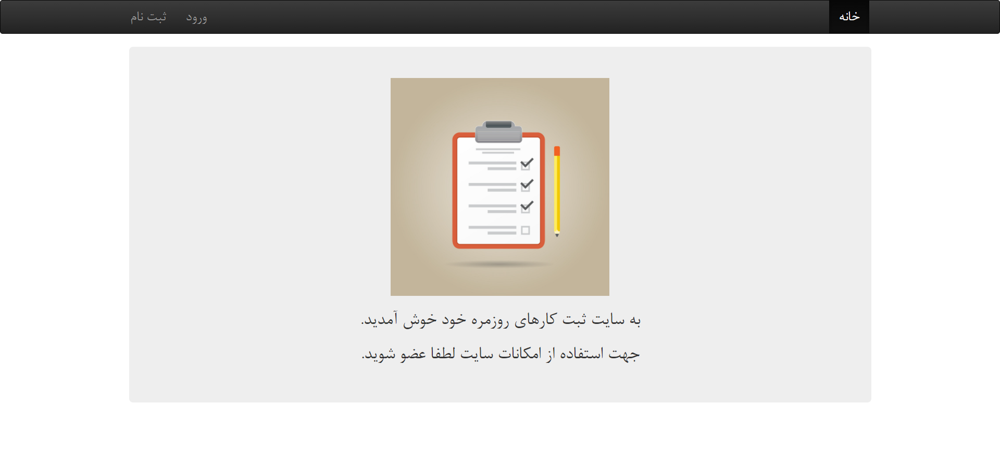
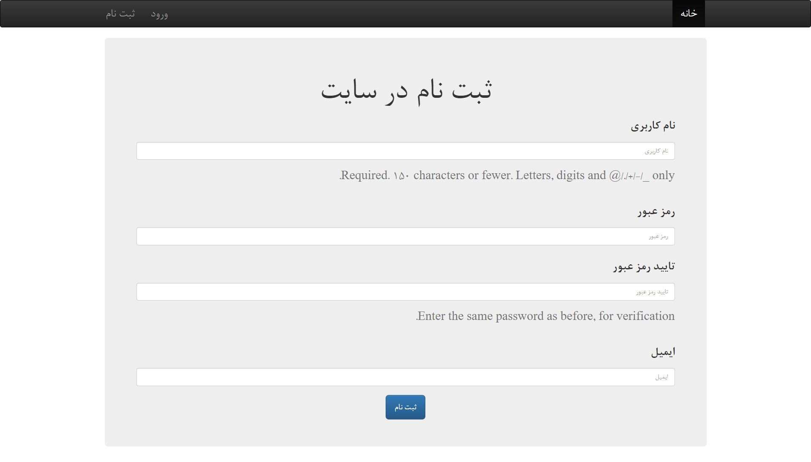
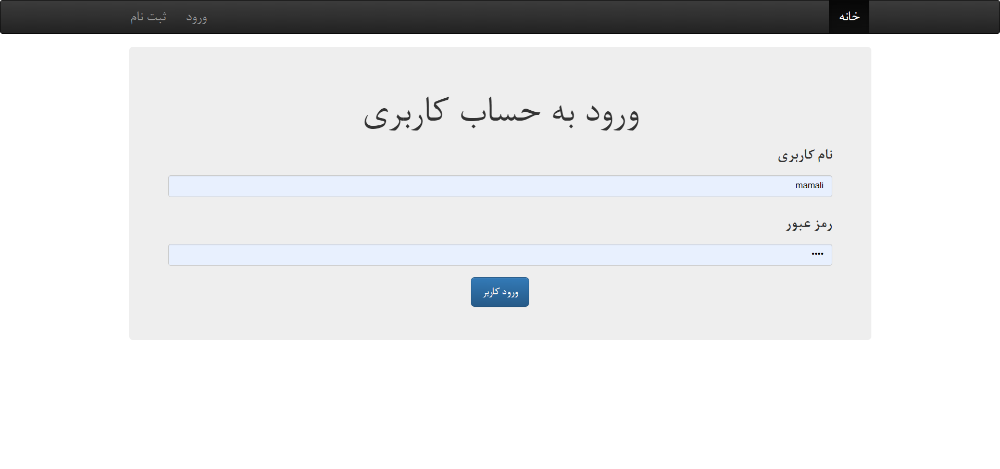
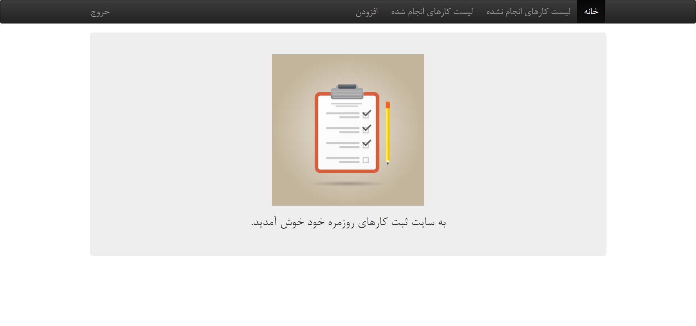
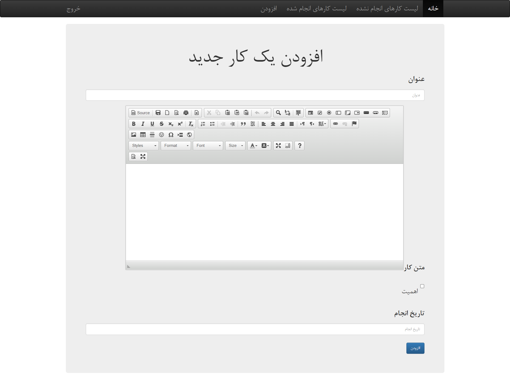
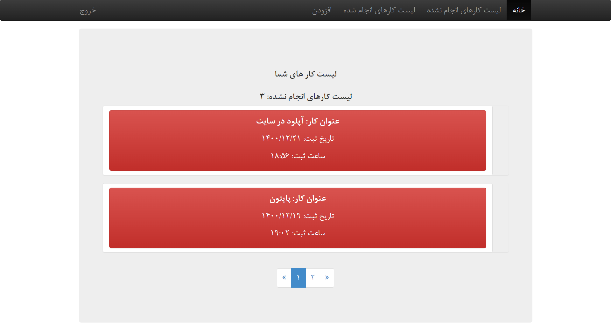
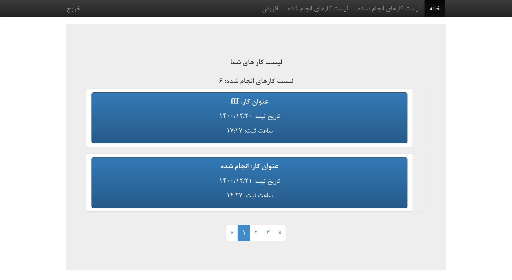

<h1 align="center">پروژه To Do List فارسی</h1>

در این پروژه یک To Do List فارسی با استفاده از <b> فریمورک جنگو پایتون </b> پیاده سازی شده است.

    

 وبلاگ در هاست رایگان سایت pythonanywhere پیاده سازی شده است. برای مشاده آنلاین وبلاگ میتوانید به لینک مقابل مراجعه کنید: <a href='http://mohammadgholampour.pythonanywhere.com/'>پروژه وبلاگ </a>
  

  
   
   
   

<h2 align="center">نحوه استفاده از امکانات پروژه:</h2>

  جهت استفاده از سایت کاربر در ابتدا باید در سایت عضو شود.
  

    

  

بعد از عضویت کاربر به طور خودکار به صفحه لاگین منتقل می‌شود حال کاربر باید نام کاربری و رمز عبوری که در مرحله قبل وارد کرده است را وارد نماید.

    
    
    

پس از لاگین کردن سه گزینه "لیست کارهای انجام شده، لیست کارهای انجام نشده و افزودن" در منوی سایت پدید می آید.

    
    
    
    
    

برای افزودن یک کارجدید باید روی گزینه افزودن کلیک کند. پس از کلیک به صفحه افزودن یک کار جدید هدایت می‌شود. در اینجا کاربر عنوان و متن کار را وارد می کند. تیک اهمیت به معنای مهم بودن کار می باشد. و درصورت زدن تیک اهمیت، کار در قسمت لیست کارهای انجام نشده با پس زمینه قرمز که بیانگر اهمیت این کار است نمایش داده می شود. در غیر اینصورت کار با پس زمینه آبی به معنای اهمیت کمتر نمایش داده می‌شود. در مرحله آخر تاریخ انجام کار را حتما خالی بگذارید. افزودن تاریخ به معنای انجام کار میباشد.

    
    

جهت مشاهده لیست کار های انجام نشده ای که پیش تر وارد کرده اید. به صفحه لیست کارهای انجام شده بروید در آنجا همه کارهایی که افزوده اید را ببینید.

    
    

با کلیک بر روی هر کدام از کارها علاوه بر نمایش جزئیات آن کار امکان حذف و ویرایش آن کار را نیز دارا می باشید.

    
    
    

در صورتی که کار را به اتمام رسانده اید و می خواهید آن را در سایت ثبت کنید کافی است از طریق صفحه لیست کارهای انجام نشده کار مورد نظر خود را پیدا کرده و روی آن کلیک کنید. پس از ورود به صفحه جزئیات آن کار بر روی گزینه ویرایش کلیک کرده و تاریخ انجام کار را وارد کرده و افزودن را بزنید. پس از اینکار دیگر آن کار در صفحه لیست کاری انجام شده نیست بلکه از این به بعد آن کار در صفحه لیست کارهای انجام شده قرار دارد.

    
    
    
  
